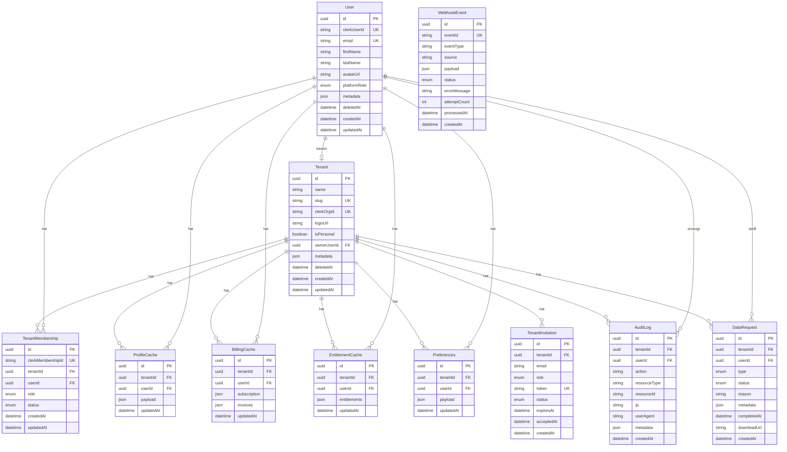

# MOJO Accounts - Customer Account Portal

Das zentrale Self-Service-Portal für MOJO-Kunden zur Verwaltung ihrer digitalen Identität und Abonnements.

## Überblick

MOJO Accounts ist ein Multi-Tenant Account-Management-System mit folgenden Funktionen:

- **Profilverwaltung** - Persönliche Daten & Rechnungskontakt
- **Multi-Tenancy** - Teams/Organisationen mit Rollenverwaltung
- **Abonnement-Management** - Subscription-Status, Rechnungen, Billing Portal
- **Berechtigungen** - Entitlements für Kurse, Features, Ressourcen
- **Kommunikation** - Newsletter, Benachrichtigungen, Einstellungen
- **Sicherheit** - 2FA, Passwort-Management via Clerk
- **DSGVO-Compliance** - Datenexport & Account-Löschung

**Live URLs:**
- Production: https://accounts.mojo-institut.de
- Development: https://dev.account.mojo-institut.de

---

## Architektur

```
┌──────────────────────────────────────────────────────────────────────────┐
│                         Traefik Reverse Proxy                            │
│              accounts.mojo-institut.de / dev.account.mojo-institut.de    │
├─────────────────────┬─────────────────────┬──────────────────────────────┤
│        /            │      /api/*         │       (Intern)               │
│     Frontend        │        API          │      PostgreSQL              │
│    (Next.js 14)     │     (Fastify)       │                              │
│       :3000         │       :3001         │        :5432                 │
├─────────────────────┴─────────────────────┴──────────────────────────────┤
│                           Externe Services                               │
├─────────────────────┬─────────────────────┬──────────────────────────────┤
│       Clerk         │   payments.mojo     │      kontakte.mojo           │
│  (Authentifizierung)│    (Billing)        │        (CRM)                 │
└─────────────────────┴─────────────────────┴──────────────────────────────┘
```

---

## Schnellstart

### Voraussetzungen

- Docker & Docker Compose
- Node.js 22+ (für lokale Entwicklung)
- Git

### 1. Repository klonen und konfigurieren

```bash
cd /root/projects/accounts.mojo

# Environment-Variablen kopieren
cp env.example .env

# Secrets anpassen (Clerk Keys, DB-Passwort, etc.)
nano .env
```

### 2. Docker-Netzwerk erstellen

```bash
# Netzwerk für alle Accounts-Services
make network

# Traefik mit Netzwerk verbinden
make traefik-connect
```

### 3. Entwicklung starten

```bash
# Alles starten (mit Hot-Reload)
make dev

# Oder im Hintergrund
make dev-detached
```

### 4. Datenbank initialisieren

```bash
# Migrationen ausführen
make migrate

# Demo-Daten seeden (optional)
make seed
```

### 5. Aufrufen

- **Frontend:** http://localhost:3000
- **API Health:** http://localhost:3001/api/v1/health
- **API Detailed Health:** http://localhost:3001/api/v1/health/detailed
- **Prisma Studio:** `make studio`

---

## Projektstruktur

```
accounts.mojo/
├── apps/
│   ├── api/                      # Fastify Backend
│   │   ├── src/
│   │   │   ├── routes/           # API Endpoints
│   │   │   │   ├── health.ts     # Health & Readiness Probes
│   │   │   │   ├── me.ts         # Session & Tenant Switch
│   │   │   │   ├── tenants.ts    # Tenant CRUD & Members
│   │   │   │   ├── profile.ts    # Profil & Consents
│   │   │   │   ├── preferences.ts# Einstellungen
│   │   │   │   ├── billing.ts    # Subscription & Invoices
│   │   │   │   ├── entitlements.ts # Berechtigungen
│   │   │   │   ├── data.ts       # DSGVO Export/Löschung
│   │   │   │   ├── webhooks.ts   # Payment & CRM Webhooks
│   │   │   │   ├── clerk-webhooks.ts # Clerk Identity Webhooks
│   │   │   │   └── internal.ts   # Service-to-Service API
│   │   │   ├── middleware/
│   │   │   │   ├── auth.ts       # Clerk JWT Verifizierung
│   │   │   │   ├── rbac.ts       # Role-Based Access Control
│   │   │   │   └── error-handler.ts
│   │   │   ├── services/
│   │   │   │   └── audit.ts      # Audit Logging
│   │   │   ├── clients/
│   │   │   │   ├── crm.ts        # kontakte.mojo Client
│   │   │   │   └── payments.ts   # payments.mojo Client
│   │   │   └── lib/
│   │   │       ├── prisma.ts     # Database Client
│   │   │       └── env.ts        # Environment Validation
│   │   ├── prisma/
│   │   │   ├── schema.prisma     # Datenbank-Schema
│   │   │   └── seed.ts           # Demo-Daten
│   │   └── Dockerfile
│   │
│   └── web/                      # Next.js 14 Frontend
│       ├── src/
│       │   ├── app/              # App Router Pages
│       │   │   ├── page.tsx      # Dashboard
│       │   │   ├── profile/      # Profil bearbeiten
│       │   │   ├── membership/   # Abo-Verwaltung
│       │   │   ├── team/         # Team-Management
│       │   │   ├── security/     # Sicherheit (Clerk)
│       │   │   ├── preferences/  # Einstellungen
│       │   │   ├── data/         # DSGVO Export/Löschung
│       │   │   ├── support/      # Hilfe & Support
│       │   │   └── invite/       # Einladung annehmen
│       │   ├── components/
│       │   │   ├── Sidebar.tsx   # Navigation
│       │   │   └── ui/           # shadcn/ui Components
│       │   ├── lib/
│       │   │   ├── api.ts        # API Client
│       │   │   └── utils.ts      # Hilfsfunktionen
│       │   └── providers/
│       │       └── TenantProvider.tsx # Multi-Tenant Context
│       └── Dockerfile
│
├── packages/
│   └── shared/                   # Gemeinsame Types & Schemas
│       └── src/
│           ├── types/            # TypeScript Interfaces
│           └── schemas/          # Zod Validation Schemas
│
├── infra/
│   ├── docker-compose.yml        # Base Compose
│   ├── docker-compose.dev.yml    # Dev Override
│   └── docker-compose.prod.yml   # Prod Override
│
├── docs/
│   └── PORT.md                   # Port-Dokumentation
│
├── env.example                   # Environment Template
├── Makefile                      # Alle Befehle
└── README.md
```

---

## Frontend-Seiten

| Route | Seite | Beschreibung |
|-------|-------|--------------|
| `/` | Dashboard | Übersicht: Status, Berechtigungen, Team, Schnellzugriff |
| `/profile` | Profil | Name, E-Mail, Telefon, Adresse, Firma, USt-ID |
| `/membership` | Mitgliedschaft | Abo-Status, Plan, Rechnungen, Billing Portal |
| `/team` | Team | Mitglieder verwalten, Einladungen, Rollen |
| `/security` | Sicherheit | Passwort, 2FA, Sessions (via Clerk) |
| `/preferences` | Einstellungen | Newsletter, Benachrichtigungen, Sprache, Zeitzone |
| `/data` | Daten & Privatsphäre | DSGVO Export, Account-Löschung |
| `/support` | Hilfe | FAQ, Support-Kontakt |
| `/invite` | Einladung | Team-Einladung annehmen |

---

## API-Referenz

### Öffentliche Endpoints

| Endpoint | Methode | Beschreibung |
|----------|---------|--------------|
| `/api/v1/health` | GET | Einfacher Health Check |
| `/api/v1/health/detailed` | GET | Detaillierter Health Check mit Service-Status |
| `/api/v1/ready` | GET | Kubernetes Readiness Probe |
| `/api/v1/live` | GET | Kubernetes Liveness Probe |

### Authentifizierte Endpoints (Clerk JWT erforderlich)

#### Session & Tenant

| Endpoint | Methode | Beschreibung |
|----------|---------|--------------|
| `/api/v1/me` | GET | Aktuelle Session + alle Tenants |
| `/api/v1/tenants/switch` | POST | Aktiven Tenant wechseln |

#### Tenants

| Endpoint | Methode | Beschreibung |
|----------|---------|--------------|
| `/api/v1/tenants` | GET | Alle Tenants des Users auflisten |
| `/api/v1/tenants` | POST | Neuen Tenant erstellen |
| `/api/v1/tenants/:id` | GET | Tenant-Details inkl. Mitglieder |
| `/api/v1/tenants/:id` | PATCH | Tenant bearbeiten (Name, Slug, Logo) |
| `/api/v1/tenants/:id/invite` | POST | Mitglied einladen |
| `/api/v1/tenants/:id/members/:mid/role` | POST | Mitglieder-Rolle ändern |
| `/api/v1/tenants/:id/members/:mid` | DELETE | Mitglied entfernen |
| `/api/v1/tenants/:id/invitations/:iid` | DELETE | Einladung widerrufen |

#### Profil

| Endpoint | Methode | Beschreibung |
|----------|---------|--------------|
| `/api/v1/profile` | GET | Profil abrufen (CRM-backed + Cache) |
| `/api/v1/profile` | PATCH | Profil aktualisieren |
| `/api/v1/profile/consents` | GET | DSGVO Consents abrufen |
| `/api/v1/profile/consents` | PATCH | Consents aktualisieren |

#### Einstellungen

| Endpoint | Methode | Beschreibung |
|----------|---------|--------------|
| `/api/v1/preferences` | GET | Einstellungen abrufen |
| `/api/v1/preferences` | PATCH | Einstellungen aktualisieren |

#### Billing

| Endpoint | Methode | Beschreibung |
|----------|---------|--------------|
| `/api/v1/billing/subscription` | GET | Aktuelles Abo abrufen |
| `/api/v1/billing/invoices` | GET | Rechnungen auflisten |
| `/api/v1/billing/portal` | POST | Stripe Billing Portal URL erstellen |

#### Berechtigungen

| Endpoint | Methode | Beschreibung |
|----------|---------|--------------|
| `/api/v1/entitlements` | GET | Alle Berechtigungen (gruppiert) |
| `/api/v1/entitlements/:resourceId` | GET | Einzelne Berechtigung prüfen |

#### DSGVO / Datenschutz

| Endpoint | Methode | Beschreibung |
|----------|---------|--------------|
| `/api/v1/data/requests` | GET | Alle Datenanfragen auflisten |
| `/api/v1/data/export-request` | POST | Datenexport anfordern |
| `/api/v1/data/delete-request` | POST | Account-Löschung anfordern |
| `/api/v1/data/requests/:id` | DELETE | Anfrage stornieren |

### Webhook Endpoints (Signatur-verifiziert)

| Endpoint | Beschreibung | Signatur-Header |
|----------|--------------|-----------------|
| `/api/v1/webhooks/payments` | Payment Events (Stripe via payments.mojo) | `X-Webhook-Signature` |
| `/api/v1/webhooks/crm` | CRM Events (kontakte.mojo) | `X-Webhook-Signature` |
| `/api/v1/webhooks/clerk` | Clerk Identity Events | Svix Headers |

**Clerk Webhook Events:**
- `user.created` - Neuer User → DB-Eintrag + Personal Org
- `user.updated` - User aktualisiert
- `user.deleted` - User soft-delete
- `organization.created/updated/deleted` - Org-Sync
- `organizationMembership.created/updated/deleted` - Membership-Sync

### Internal API (Service-to-Service)

Authentifizierung via `X-Internal-Token` Header.

| Endpoint | Methode | Beschreibung |
|----------|---------|--------------|
| `/api/internal/users/:clerkUserId` | GET | User by Clerk ID |
| `/api/internal/users/:clerkUserId/tenants` | GET | User's Tenants |
| `/api/internal/tenants/:clerkOrgId` | GET | Tenant by Clerk Org ID |
| `/api/internal/tenants/:clerkOrgId/memberships` | GET | Tenant Members |
| `/api/internal/lookup/email/:email` | GET | User by Email |
| `/api/internal/lookup/slug/:slug` | GET | Tenant by Slug |
| `/api/internal/health` | GET | Internal Health + Stats |
| `/api/internal/webhook-events` | GET | Webhook Event Log |

---

## Authentifizierung & Autorisierung

### Clerk Integration

Das Projekt verwendet **Clerk** für Authentifizierung:

1. **Frontend:** ClerkProvider mit JWT
2. **Backend:** JWT-Verifizierung via `@clerk/backend`
3. **Multi-Tenancy:** Clerk Organizations → Tenant Mapping
4. **Webhooks:** Automatische User/Org/Membership Synchronisation

### Tenant-Rollen

| Rolle | Beschreibung | Berechtigungen |
|-------|--------------|----------------|
| `owner` | Inhaber | Voller Zugriff, kann nicht entfernt werden |
| `admin` | Administrator | Kann Mitglieder verwalten, Tenant bearbeiten |
| `member` | Mitglied | Standard-Zugriff |
| `billing_admin` | Billing-Admin | Nur Billing-Bereich |
| `support_readonly` | Support | Nur Lesen |

### Platform-Rollen (Plattform-weit)

| Rolle | Beschreibung |
|-------|--------------|
| `platform_admin` | Voller Plattform-Zugriff |
| `platform_support` | Support-Zugriff |
| `platform_finance` | Finanz-Zugriff |
| `platform_content_admin` | Content-Verwaltung |

### RBAC Middleware

Die RBAC-Middleware (`middleware/rbac.ts`) bietet granulare Berechtigungsprüfung:

```typescript
// Beispiele aus tenants.ts
{ preHandler: [requireTenantAccess()] }                    // Tenant-Mitglied
{ preHandler: [requireTenantAccess(), requireRole('admin', 'owner')] }  // Admin oder Owner
{ preHandler: [requireTenantAccess(), requireMemberManagement()] }      // Kann Mitglieder verwalten
```

---

## Datenbank-Schema



### Enums

```prisma
enum PlatformRole {
  platform_admin
  platform_support
  platform_finance
  platform_content_admin
}

enum TenantRole {
  owner
  admin
  member
  billing_admin
  support_readonly
}

enum MembershipStatus {
  active
  invited
  suspended
  removed
}

enum InvitationStatus {
  pending
  accepted
  expired
  revoked
}

enum DataRequestType {
  export
  delete
}

enum DataRequestStatus {
  pending
  processing
  completed
  failed
}

enum WebhookStatus {
  pending
  processing
  success
  failed
}
```

---

## Integrationen

### payments.mojo (Billing)

Client: `apps/api/src/clients/payments.ts`

- `getSubscription()` - Aktuelles Abo abrufen
- `getInvoices()` - Rechnungen auflisten
- `getEntitlements()` - Berechtigungen abrufen
- `createBillingPortalSession()` - Stripe Portal URL

### kontakte.mojo (CRM)

Client: `apps/api/src/clients/crm.ts`

- `getProfile()` - Profildaten abrufen
- `updateProfile()` - Profil aktualisieren
- `getConsents()` - DSGVO Consents abrufen
- `updateConsents()` - Consents aktualisieren

### Mock-Modus

Für lokale Entwicklung ohne externe Services:

```bash
MOCK_EXTERNAL_SERVICES=true
```

---

## Technische Details

### Caching-Strategien

| Cache | TTL | Beschreibung |
|-------|-----|--------------|
| ProfileCache | 5 Minuten | Profildaten von CRM |
| BillingCache | 1 Minute | Subscription & Invoices |
| EntitlementCache | 5 Minuten | Berechtigungen |

### Rate Limiting

- **100 Requests pro Minute** pro IP
- Konfiguriert via `@fastify/rate-limit`

### Audit Logging

Alle wichtigen Aktionen werden in `AuditLog` protokolliert:

```typescript
// Beispiel aus services/audit.ts
await logAuditEvent(request, {
  action: AuditActions.PROFILE_UPDATE,
  resourceType: 'profile',
  resourceId: userId,
  metadata: { fields: Object.keys(input) },
});
```

**Geloggte Aktionen:**
- `PROFILE_VIEW`, `PROFILE_UPDATE`
- `PREFERENCES_UPDATE`
- `BILLING_VIEW`, `BILLING_PORTAL_ACCESS`
- `TENANT_CREATE`, `TENANT_UPDATE`
- `MEMBER_INVITE`, `MEMBER_ROLE_CHANGE`, `MEMBER_REMOVE`
- `DATA_EXPORT_REQUEST`, `DATA_DELETE_REQUEST`

### Webhook Idempotency

Clerk Webhooks werden über `WebhookEvent` dedupliziert:

```typescript
// Check for duplicate event
const existingEvent = await prisma.webhookEvent.findUnique({
  where: { eventId: svixId },
});

if (existingEvent) {
  return reply.send({ received: true, processed: false, reason: 'Duplicate event' });
}
```

### Personal Organization Provisioning

Bei `user.created` wird automatisch eine persönliche Organisation erstellt:

1. Clerk Organization mit Slug `personal-{userId}` erstellen
2. Lokaler Tenant mit `isPersonal: true`
3. Owner-Membership für User
4. Default Preferences

---

## Deployment

### Production (Hetzner)

```bash
# 1. SSH auf Server
ssh root@your-server

# 2. Projekt klonen
cd /root/projects
git clone <repo-url> accounts.mojo
cd accounts.mojo

# 3. Environment konfigurieren
cp env.example .env
nano .env  # Secrets eintragen

# 4. Netzwerk erstellen
make network
make traefik-connect

# 5. Production starten
make prod

# 6. Migrationen
make migrate
```

### DNS

A-Record für `accounts.mojo-institut.de` → Server-IP

### Environment-Variablen

```bash
# Database
POSTGRES_USER=accounts
POSTGRES_PASSWORD=<sicher>
POSTGRES_DB=accounts_db
DATABASE_URL=postgresql://...

# Clerk
CLERK_SECRET_KEY=sk_live_...
CLERK_PUBLISHABLE_KEY=pk_live_...
NEXT_PUBLIC_CLERK_PUBLISHABLE_KEY=pk_live_...
CLERK_WEBHOOK_SECRET=whsec_...

# Frontend
FRONTEND_URL=https://accounts.mojo-institut.de
NEXT_PUBLIC_API_URL=https://accounts.mojo-institut.de

# External Services
PAYMENTS_API_URL=https://payments.mojo-institut.de/api/v1
PAYMENTS_API_KEY=<key>
CRM_API_URL=https://kontakte.mojo-institut.de/api/v1
CRM_API_KEY=<key>

# Mock Mode (nur Development)
MOCK_EXTERNAL_SERVICES=false

# Webhook Secrets
WEBHOOK_SECRET_PAYMENTS=<openssl rand -hex 32>
WEBHOOK_SECRET_CRM=<openssl rand -hex 32>

# Internal API
INTERNAL_API_SECRET=<openssl rand -hex 32>

# Email (optional)
EMAIL_FROM=noreply@mojo-institut.de
SENDGRID_API_KEY=<key>

# Environment
NODE_ENV=production
```

---

## Makefile-Referenz

| Befehl | Beschreibung |
|--------|--------------|
| `make help` | Hilfe anzeigen |
| `make install` | Alle Dependencies installieren |
| `make build` | Alle Packages bauen |
| `make dev` | Development starten (mit Logs) |
| `make dev-detached` | Development im Hintergrund |
| `make prod` | Production starten |
| `make down` | Container stoppen |
| `make logs` | Alle Logs anzeigen |
| `make logs-api` | Nur API-Logs |
| `make logs-web` | Nur Web-Logs |
| `make migrate` | DB-Migrationen (Production) |
| `make migrate-dev` | DB-Migrationen (Development) |
| `make seed` | Demo-Daten laden |
| `make studio` | Prisma Studio öffnen |
| `make generate` | Prisma Client generieren |
| `make test` | Tests ausführen |
| `make clean` | Alles aufräumen |
| `make network` | Docker-Netzwerk erstellen |
| `make traefik-connect` | Traefik verbinden |

---

## Entwicklung

### Lokale Entwicklung (ohne Docker)

```bash
# Dependencies installieren
make install

# Shared Package bauen
npm run build:shared

# API starten (Terminal 1)
cd apps/api
npm run dev

# Frontend starten (Terminal 2)
cd apps/web
npm run dev
```

### Datenbank-Migrationen

```bash
# Neue Migration erstellen (Development)
cd apps/api
npx prisma migrate dev --name <migration-name>

# Migration auf Production anwenden
make migrate

# Prisma Client neu generieren
make generate
```

### Tests

```bash
make test
```

---

**Zuletzt aktualisiert:** 2024-12-28
